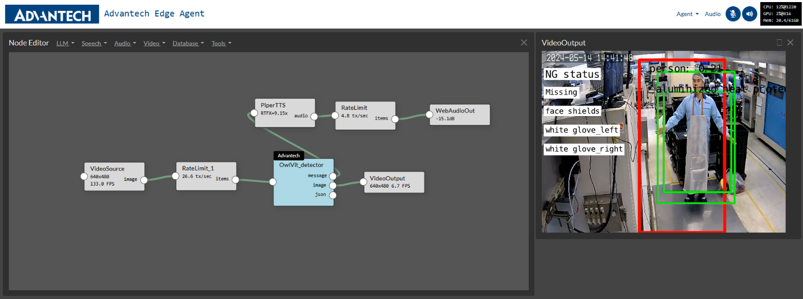

# Edge Agent Introduction & Deployment 

Rapidly design and experiment with creating automation agents, personal assistants, and edge AI systems in an interactive environment. This sandbox enables seamless integration of multimodal LLMs, speech and vision transformers, vector databases, prompt templates, and function calling with live sensors and I/O. Optimized for deployment on Jetson devices, it offers on-device computing, low-latency streaming, and unified memory for enhanced performance.


## System Configuration


| Name           | Description                                        |
| -------------- | -------------------------------------------------- |
| Product        | MIC-733-OA3A1 (32GB) / MIC-733-OA4A1 (64GB)        |
| JetPack        | V6.0GA                                             |
| Storage (NVMe) | 512GB (recommended)                                |
| USB Camera     | Logitech c270 HD webcam or V4L2 compatible camera. |
| Internet       | Internet connection is required while installation |

## 

## Platform Setup and Storage Expansion

###  SSD Physical Installation 

1.  Disconnect the power supply and any peripherals from your Jetson
    developer kit.

2.  Carefully insert an NVMe SSD card into the carrier board of your
    Jetson developer kit, ensuring the connector is properly seated and
    secured with the screw.

3.  Afterwards, reconnect any peripherals and plug the power supply back
    in to power on the Jetson developer kit.

4.  Once the system boots up, check that your Jetson recognizes the new
    memory controller on the PCI bus.

> lspci

The output should look like the following:

> 0007:01:00.0 Non-Volatile memory controller: Marvell Technology Group
> Ltd. Device 1322 (rev 02)

### Format and set up auto-mount and swap docker storage to ssd

1\. Run lsblk to find the device name.

> lsblk

The output should look like the following:

NAME MAJ:MIN RM SIZE RO TYPE MOUNTPOINT

loop0 7:0 0 16M 1 loop

mmcblk1 179:0 0 59.5G 0 disk

....

nvme0n1 259:0 0 238.5G 0 disk

Identify the device corresponding to your SSD. In this case, it
is nvme0n1.

2\. Format the SSD, create a mount point, and mount it to the
filesystem.

> sudo mkfs.ext4 /dev/nvme0n1
>
> sudo mkdir /ssd
>
> sudo mount /dev/nvme0n1 /ssd

3\. In order to ensure that the mount persists after boot.

First, identify the UUID for your SSD:

> lsblk -f | grep nvme0n1
>

Record the UUID, then create a /etc/rc.local file:

> sudo vi /etc/rc.local

Insert the following lines , replacing the UUID with the value found from lsblk -f:

> #!/bin/bash
>
> sleep 10
>
> mount UUID=\*\*\*\*\*\*\*\*\*\*\*\*-\*\*\*\*-\*\*\*\*-\*\*\*\*-\*\*\*\*\*\*\*\* /ssd
>
> systemctl daemon-reload
>
> systemctl restart docker
>
> journalctl -u docker
>
> exit 0
>

4\. Then, ensure the file has execute permissions.

> sudo chmod +x /etc/rc.local

5\. Finally, change the ownership of the /ssd directory.

> sudo chown \${USER}:\${USER} /ssd

### Migrate Docker directory to SSD

Now that the SSD is installed and available on your device, you can use
the extra storage capacity to hold the storage-demanding Docker
directory.

1. Stop the Docker service.

   > sudo systemctl stop docker

2. Move the existing Docker folder

   > sudo du -csh /var/lib/docker/ 
   >
   > sudo mkdir /ssd/docker
   >
   > sudo rsync -axPS /var/lib/docker/ /ssd/docker/ 
   >
   > sudo du -csh /ssd/docker/

3. Edit /etc/docker/daemon.json

   > sudo vi /etc/docker/daemon.json

Insert \"data-root\" line like the following.

{

  \"runtimes\": {

  \"nvidia\": {

  "args": \[\],

  \"path\": \"nvidia-container-runtime\",

}

},

  \"default-runtime\": \"nvidia\",

  \"data-root\": \"/ssd/docker\"

}

4. Rename the old Docker data directory and remove it

   > sudo mv /var/lib/docker /var/lib/docker.old
   >
   > (optional) sudo rm -rf /var/lib/docker.old

5. Restart the docker daemon

   > sudo systemctl daemon-reload && \\
   >
   > sudo systemctl restart docker && \\
   >
   > sudo journalctl -u docker
   >

### Test Docker on SSD (Optional)

1.  \[Terminal 1\] First, open a terminal to monitor the disk usage
    while pulling a Docker image.

> watch -n1 df

2.  \[Terminal 2\] Next, open a new terminal and start Docker pull.

> docker pull nvcr.io/nvidia/l4t-base:r35.2.1

3.  \[Terminal 1\] Observe that the disk usage on /ssd goes up as the
    container image is downloaded and extracted.

> \~\$ docker image ls
>
> REPOSITORY TAG IMAGE ID CREATED SIZE
>
> nvcr.io/nvidia/l4t-base r35.2.1 dc07eb476a1d 7 months ago 713MB

###  Disable Apport reporting (Optional)

Every time Edge Agent crashes, a crash report is generated. These
reports require a significant amount of storage space and can quickly
fill up your system\'s hard drive. (Apport reports are stored in
/var/lib/apport/coredump). To prevent these reports from being
generated, you need to disable Apport.

> a\. configure the apport default setting 
>
>   $sudo vim /etc/default/apport
>
> ​    Set enabled to 0
>
> b. Restart the service
>
>   $ sudo systemctl stop apport && sudo systemctl disable apport

## Deploy and Run Edge Agent

### Downloading Essential Data

1\. Jetson-containers

```
cd /ssd
git clone https://github.com/dusty-nv/jetson-containers
bash jetson-containers/install.sh
```

2\. NanoLLM

```
cd /ssd
sudo apt install git-lfs
```

3\. Advantech Edge Agent repo

```
git clone https://github.com/advantech-edge-ai/edge_agent.git
```
#### Notes
- In order to join tvm splited files into the tvm-0.15.0-cp310-cp310-linux_aarch64.whl
> $ cd edge_agent/pre_install
> 
> $ bash split-cat-tvm.sh
- Place the nanodb folder **from pre_install to** /ssd/jetson-containers/data/
> $ mv nanodb /ssd/jetson-container/data/
- move forbidden_zone folder **from pre_install to** /ssd/jetson-containers/data/images/
> $ mv forbidden_zone /ssd/jetson-container/data/images/
- move demo folder **from pre_install to** /ssd/jetson-containers/data/videos/
> $ mv demo /ssd/jetson-container/data/videos/

4 Agent studio Container

```
docker pull dustynv/nano_llm:24.7-r36.2.0
```

\# Go inside Docker to fix bugs

```
jetson-containers run \
-v /ssd/edge_agent:/opt/NanoLLM \
dustynv/nano_llm:24.7-r36.2.0 \
/bin/bash
```

\# After entering container, apply patches.

This will take a while to build and install like 15 mins. Check there is no error happened.

```
cd /opt/NanoLLM/pre_install && sh pre_install.sh
```

\# Commit a new docker images with fixes

```
docker commit "your_container_id" dustynv/nano_llm:24.7-r36.2.0_bug_fixed
```


4.  Register on the HuggingFace Website to Obtain an Access Token (In
    the Settings)


### Start Up Edge Agent 

#### Start Edge Agent container with your own Huggingface token.

```
jetson-containers run \--env HUGGINGFACE_TOKEN= hf_xyz123abc456 \
-v /etc/machine-id:/etc/machine-id \
-v /:/dummy_root:ro \
-v /ssd/edge_agent:/opt/NanoLLM \
-v /ssd/edge_agent/pre_install/project_presets:/data/nano_llm/presets \
dustynv/nano_llm:24.7-r36.2.0_bug_fixed \
python3 -m nano_llm.studio
```

#### Or Start up without HUGGINGFACE_TOKEN

```
jetson-containers run \
-v /etc/machine-id:/etc/machine-id \
-v /:/dummy_root:ro \
-v /ssd/edge_agent:/opt/NanoLLM \
-v /ssd/edge_agent/pre_install/project_presets:/data/nano_llm/presets \
dustynv/nano_llm:24.7-r36.2.0_bug_fixed \
python3 -m nano_llm.studio
```

This will start the server running on your device. You can then navigate
your browser to <https://IP_ADDRESS:8050> (Don't use Firefox to open)

Note that

1\. You can use the \--load option to pre-load your prebuilt pipeline.

2\. If the program crashes, it will automatically load the latest
pipeline you created.

3\. Additionally, a \"clear memory\" function has been added.

> You can use the \"Agent New Project\" option in the top right corner.
> Before opening a new project, you can choose to keep the current
> pipeline you created or discard it.
>
> or
>
> You can open a browser and go to https://IP_ADDRESS:8050/reload ,
> after waiting about 15 seconds, log back into https://IP_ADDRESS:8050.
>
> With either method, you can see your memory return to its initial
> state.


## Edge Agent Tool Function

This section will introduce the functions of each node in the Edge Agent
toolbar.

### LLM

1.  #### NanoLLM_ICL

Load quantized LLM/VLM with MLC (speed), AWQ (quality), or HF
Transformers (compatability)

also supports ICL (In-Context Learning)

> \- Inputs
>
> \* str, list\[str\], np.ndarray, torch.Tensor, cudaImage, PIL.Image
>
> \- Commands
>
> \* /reset /refresh /generate (these inputs can control the chat)
>
> \- Outputs
>
> \* delta The latest detokenized text to be generated
>
> \* partial All of the text generated in the response so far
>
> \* final The complete response sent at the end of the request
>
> \* words Similar to \'delta\', but with at least one word at a time
>
> \* history A list of the messages in the chat history (as dictionaries)
>
> \* tools Enable the bot to call functions in plugins connected on this
> channel

2.  #### AutoPrompt_ICL

Automatically apply a template whenever new data arrives. For example,
the template \'\<image\> Describe the image\' would tag each incoming
image with this text prompt, typically used with VLMs. AutoPrompt can
generate structured messages that refer to previous inputs, such as
Image 1: \<image\> Image 2: \<image\>, or by using \<text\> for the last
received text. These recent inputs are used in a last-in, first-out
(LIFO) sequence.

This AutoPrompt_ICL also supports ICL fearture. Users can input images
as ICL inputs by enclosing the image path in triple quotes (\'\'\'). For
example, by applying the template '''my_image.png'''.

The User can also detetmine whether to use ROI and setting ROI region.

3.  #### UserPrompt

This plugin allows you to enter text using the keyboard, either through
the terminal or a text box in the user interface. Additionally, it can
load prompts from text or JSON files, and these files can include
references to other files for loading.

4.  #### Textstream

A basic plugin for displaying any text stream from the system in a UI
text box. For sources from ASR or LLM, it can add color highlights to
partial and final responses.

### Speech

1.  #### WhisperASR

Whisper streaming speech-to-text with TensorRT
(github.com/NVIDIA-AI-IOT/whisper_trt)

Supports these Whisper models: \'tiny\' (39M), \'base\' (74M), \'small\'
(244M)

> \- Inputs
>
> \* audio bytes, list\[int\], np.ndarray, torch.Tensor (int16, float32)
>
> \- Outputs
>
> \* final The text transcript of the entire segment spoken in the input
>
> \* partial Rolling partial transcript of the words spoken so far in the
> audio segment


2.  #### PiperTTS

Piper text-to-speech using CUDA and onnxruntime
(github.com/rhasspy/piper)

Populates a list of the available Piper models that it can download,
along with the speaker voices

for multi-speaker models. The default model is \'en_US-libritts-high\'.
Has controls for voice speed.

> \- Inputs
>
> \* str either individual words, sentences, or an entire passage to
> synthesize
>
> \- Outputs
>
> \* audio np.ndarray (int16) at 16KHz sample rate (for low-quality
> models) or 22.5KHz
>
> (for medium/high)


3.  #### VAD Filter

Voice activity detection model using Silero. Drops incoming audio unless
it exceeds the VAD threshold.

Use this on incoming audio before ASR plugins to reduce spurious
transcripts produced from background noise.

> \- Inputs
>
> \* audio bytes, list\[int\], np.ndarray, torch.Tensor (int16, float32)
>
> \- Outputs
>
> \* audio np.ndarray or torch.Tensor (only when VAD confidence \>
> threshold)


### Audio

1.  [AudioRecorder](https://github.com/dusty-nv/NanoLLM/blob/main/nano_llm/plugins/audio/audio_output.py)

Save an audio stream to WAV file on the server.

2.  [WebAudioIn](https://github.com/dusty-nv/NanoLLM/blob/main/nano_llm/plugins/audio/web_audio.py)

Recieve audio samples streamed from the client over websockets.

3.  [WebAudioOut](https://github.com/dusty-nv/NanoLLM/blob/main/nano_llm/plugins/audio/web_audio.py)

Transmit audio samples to the client over websockets.

### Video

1.  VideoSource:

Capture images from a camera (V4L2/CSI), network streams (RTP, RTSP), or
video files (MP4, MKV, AVI, FLV).

2.  VideoOutput

Output H264/H265-encoded video to a network stream (RTP, RTSP, WebRTC),
ROI, display, or save it to a file (MP4, MKV, AVI, FLV).

3.  VideoOverlay

Overlay text on video streams for a HUD or OSD-style display.

4.  RateLimit

Limit transmission speed to a specified rate, applicable for both video
and audio.

### Database

1.  **NanoDB_Fashion**

An optimized in-memory multimodal vector database designed specifically
for text-to-image (txt2img) and image-to-image (img2img) similarity
searches, as well as image tagging. Simply place images into a folder,
and a database tailored to that folder will be generated instantly. This
versatile database supports insert and delete operations, as well as
retrieval-augmented generation (RAG) searches, providing a seamless and
efficient way to manage and query your image data.

### Tools

1.  #### **OwlVit_detector**

Use TensorRT-accelerated OWLv2 for detection tasks.

> \- Inputs
>
> \* cudaImage, PIL.Image
>
> \- Outputs
>
> \* image The detection visualized output
>
> \* message The detection status output
>
> \* MQTT The detection json result for MQTT


2.  #### **One_Step_Alert**

Alerts are triggered based on specified keywords, with the system
monitoring their frequency within a set number of seconds. If the
majority of occurrences within this interval match alert keywords, an
alarm is activated.

3.  #### **Two_Steps_Alert**

The system monitors specified alert keywords, counting their frequency
within a set timeframe to determine if an alarm should be triggered.
Upon the initial alert, it moves to a second alert level. At this level,
the system checks within a specified timeframe for the presence of a
\"normal\" keyword to indicate resolution. If the normal keyword is
detected, the system resets to the first alert level; if not, the alarm
continues.

4.  #### **Save_Pics**

The system monitors specified alert keywords and counts their frequency
within a set timeframe to determine if images should be saved. Users can
freely configure the number of images to be stored.

5.  #### **MQTT_Publisher**

This is an MQTT publisher system. It receives python dict format
messages, packages them appropriately, and sends them to a predefined
broker under a specified topic. Subscribers to this topic can receive
the messages in real-time.

### Tips and trick

Many of the previous demos, such as Llamaspeak and Live Llava, can be
easily recreated in the flexible environment of Edge Agent without any
coding. Here are some practical tips for experimenting with different
model pipeline combinations:

**UI**

-   To add elements to the agent pipeline, use the menus in the node
    editor\'s title bar or right-click inside the editor.

-   Adding elements via the context menu (right-click) will place them
    where your cursor is, so you don\'t need to manually reposition
    them.

-   To remove a component from the pipeline, right-click on it and click
    the small X button in the top-right corner.

-   To disconnect components, select the link, then right-click to make
    the X button appear.

-   Clicking a node in the graph will open its grid widget if available.
    Click again to open the settings dialog.

**Save & Load**

-   Use the Save button under the Agent menu to serialize the current
    pipeline into JSON format.

-   These saved presets are stored in a mounted directory on the host at
    jetson-containers/data/nano_llm/presets.

-   Some frequently used subgraphs, like ASR, TTS, and video VLM, are
    included for quick addition and combination.

-   You can load these subgraphs through the Agent menu, by
    right-clicking in the node editor, or by using the \--load flag at
    startup.

**Memory**

-   As you add models, monitor the system resources in the top-right
    corner to avoid running out of memory.

-   Models remain cached in memory even after being removed from the
    node editor, due to loading times.

-   To free up memory, use the New button in the Agent menu. Or add
    /reload at the end of the webpage URL.

**Performance**

-   System CPU and GPU usage can be monitored in the top-right corner.

-   Node performance statistics are regularly updated for each
    component.

-   Use the RateLimiter plugin to manage data flow and balance system
    resources.

-   The drop_inputs setting in some plugins ensures they stay current
    with the latest request.

### Create the new project

To start a new project, please follow the steps below:

1.  Click the Agent button in the top-right corner.

2.  Select New to create a new project.


If you want to save the current project: Click Save as to save the
project under a new name.

If you do not wish to keep the current project: Click Discard to proceed
without saving.


# Examples

In this section, we will showcase four demos to familiarize readers with
Edge Agent and demonstrate the types of applications it can create.

## Door detetion (Load Door_alert_webrtc_advan in presets)

The door detection system will trigger an alarm if the door is detected
as open for a specified duration. If it remains open past an additional
specified timeframe without closing, the alarm will continue. Another
node is set up to capture images of anyone opening the door. Using the
NanoDB model, it then searches for specific clothing attributes of
individuals passing through the door, allowing for keyword-based
identification of attire.


The nodes used are the ones listed above.

1.  #### VideoSource

In the \"Video\" section of the toolbar, find and select the
\"VideoSoruce Node.\" Then, make the following settings:

-   Input: Select the location of your video
    (/data/videos/demo/Door_advan.mkv). This video should be located under
    the same path in the jetson-containers folder.

-   Loops: Set to -1 to enable continuous playback of the video.

2.  #### RateLimit_1

In the \"Video\" section of the toolbar, find and select the \"RateLimit
Node.\" Then, make the following settings:

-   Set Rate to 1: This means only one frame is processed per second
    (i.e., only one frame per second).

-   Leave Chunk empty: Use the default value, no special configuration
    is needed.

-   Set Drop inputs to True: This means only the latest frame is kept,
    while older frames are discarded and not saved.

3.  #### Autoprompt_ICL

> in the \"LLM\" section of the toolbar, find and select the
> \"Autoprompt_ICL Node.\" Then, make the following settings:

-   This is to let the model know that the input prompt should be
    formatted like this. Our application is designed to determine the
    status of a safety door, so our prompt is written as follows:
    \"\<reset\>\<image\>Check the current status of the door. Is it open
    or closed?\" The \<reset\> is a special token that allows us to
    visualize the VILA model\'s output later, ensuring that only the
    results from the current frame are retained without preserving any
    historical results. The \<image\> is the location of the image being
    fed to the model, and the text following it is the question we want
    to ask.

-   seq_replace_mode set to true: When this feature is enabled, each new
    input will replace older ones step by step; if disabled, the input
    buffer will clear itself automatically when full.

-   Roi & Roi Coordinates: Represent the region of the incoming image
    that we want to focus on. In this case, we are focusing on the full
    image, so this feature does not need to be enabled. Simply set Roi
    to false.

4.  #### VILA1.5-3b

In the \"LLM\" section of the toolbar, find and select the \"NanoLLM_ICL
Node.\" Then, make the following settings:

-   Model Selection: We chose Efficient-Large-Model/VILA1.5-3b.

-   API Selection: We opted for MLC as the API, which enhances inference
    speed, allowing the system to respond more quickly.

-   Quantization Setting: We used the default q4f16_ft quantization, a
    compression technique that reduces computational load while
    maintaining model performance.

-   MaxContextLength set to 256: This means the model\'s input can
    contain up to 256 tokens, which is sufficient for determining the
    status of the safety door in our application.

-   Drop inputs set to True: This ensures that only the latest frame is
    processed by the model, discarding older frames to ensure the model
    always processes the most recent information.

-   Chat Template selected as llava-v1: This is the foundational setting
    for the model\'s chat system. Choosing a chat template that matches
    the model\'s retraining process is crucial for maintaining model
    performance; otherwise, it can severely impact system performance.

-   System Prompt use the following description: A chat between a
    curious human and an artificial intelligence assistant. The
    assistant gives helpful, detailed, and polite answers to the
    human\'s questions.

5.  #### VideoOverlay

In the \"Video\" section of the toolbar, find and select the
\"VideoOverlay Node.\" Then, make the following settings:

This part can use the default settings. This Node is intended to
influence the font, typeface, and layout of the text output from the
model when rendered on an image.

6.  #### VideoOutput

In the \" Video\" section of the toolbar, find and select the
\"VideoOutput Node.\" Then, make the following settings:

This part can use the default settings. This node is intended to
determine where the output image should be projected and whether any
related settings need adjustment, such as encoding the image into a
specific format.

7.  #### Two_Steps_Alert

> The purpose of this module is to ensure that if the door is not closed
> within a specified time (first check) after receiving status messages
> from the VILA model, a text message will be sent to the next stage of
> the alarm system. Additionally, if the door remains open past the
> specified time (second check), an alert message will also be sent as a
> reminder.
>
> In the "Tool\" section of the toolbar, find and select the
> \"Two_Steps_Alert Node.\" Then, make the following settings:

-   First Check: Deafult value is 5 seconds. This is the time required for
    the initial assessment of the door status.

-   Second Check: Default value is 1 seconds. This is used for
    re-evaluating the door status when the initial assessment shows the
    door is \"open.\"

-   Alert: Should be set to true to enable the alert functionality.

-   Alert Keyword: This parameter indicates which keyword should be
    treated as an door open, we set it to open.

-   Normal Keyword: Set it to close, when the model is determined to be
    open during the first check, it will return to the first check\'s
    judgment if the door is assessed as closed during the second check.

-   Warning Message Text: As the title, Warning message text. The period
    \".\" should be in the last. So we set it to "Warning, The door is
    opened.".

-   Drop inputs set to True: This ensures that only the latest frame is
    processed by the model, discarding older frames to ensure the model
    always processes the most recent information.

8.  #### PiperTTS


The nodes used are the ones listed above.

For this part, right-click and select presets, then choose PiperTTS to
bring up the text-to-speech system.

9.  #### RateLimit_2

In the \" Video \" section of the toolbar, find and select the
\"RateLimit Node.\" Then, make the following settings:

-   Set Rate to 1: This means only one frame is processed per second
    (i.e., only one frame per second).

-   Leave Chunk empty: Use the default value, no special configuration
    is needed.

-   Set Drop inputs to True: This means only the latest frame is kept,
    while older frames are discarded and not saved.

10. #### AutoPrompt_ICL_1

In the \" LLM\" section of the toolbar, find and select the
\"AutoPrompt_ICL Node.\" Then, make the following settings:

-   Setting the template to \<text\>\<image\> means that the input
    passed to the next node will be in the form of a list. The first
    element in this list will be a string of text, and the second
    element will be an image.

-   seq_replace_mode set to false: When this feature is enabled, each
    new input will replace older ones step by step; if disabled, the
    input buffer will clear itself automatically when full.

-   Roi & Roi Coordinates: Represent the region of the incoming image
    that we want to focus on. In this case, we are focusing on the full
    image and save the full image to database, so this feature does not
    need to be enabled. Simply set Roi to false.

11. #### Save_Pics

> In the "Tool\" section of the toolbar, find and select the \"Save_Pics
> Node.\" Then, make the following settings:

-   Check Time: Deafultset is 1 second. This setting defines how many
    seconds after the door is detected as \"open\" before the system
    starts capturing images. The default value is 1 second, meaning the
    system will begin saving images 1 second after the door opens.

-   Save Frames: Defaultset is 3 frames. This parameter sets the
    duration for how long the system will capture images after the door
    opens. After saving "Save Frames\" photos, the system will return to
    detecting the door\'s status again.

-   Save Pics Folder: Defaultset is /data/nanodb/images. This specifies
    the folder where the captured images will be stored in. If you want
    to use this default path, you\'ll need to manually create the folder
    structure in the jetson-containers folder. Additionally, the stored
    photos will be in the folder with today\'s date under the path.

-   Alert: Should be set to true to enable the alert functionality.

-   Alert Keyword: Set to \"open,\" if the \"open\" keyword predominates
    during the specified check time, the system will proceed to store
    images.

-   Drop inputs set to True: This ensures that only the latest frame is
    processed by the model, discarding older frames to ensure the model
    always processes the most recent information.

12. #### NanoDB_Fashion

> In the \"Database\" section of the toolbar, find and select the
> \"NanoDB_Fashion Node.\" Then, make the following settings:

-   Path: Default is the /data/nanodb/images. This setting defines the
    directory where the NanoDB database will either be created or loaded
    from.

-   Model: Defaultset is patrickjohncyh/fashion-clip. This parameter
    specifies the embedding model to be used, either CLIP or SigLIP. You
    can choose a model from HuggingFace or provide a local path to use a
    custom model.

-   Dtype: Defaultset is 16-bit floating point. This determines whether
    the embeddings will be computed and stored as 16-bit or 32-bit
    floating point numbers.

-   Reserve: Default is 1024 MB. This setting reserves a specific amount
    of memory in megabytes (MB) for the database vectors..

-   Top K: Defaultset is top 10 results. This setting specifies how many
    search results or the top K similar entries will be returned when
    performing a search query. You can adjust this to return more or
    fewer results based on your needs.

-   Crop: Default is enabled. This parameter controls whether image
    cropping should be enabled or disabled. CLIP was trained with image
    cropping, so enabling it is recommended for CLIP. SigLIP does not
    require cropping.

-   Drop Inputs: Defaultset is ture. If true, only the latest message
    from the input queue will be used (older messages dropped).

-   Search Time: Format is Year/Month/Day. This specifies the format for
    time-based searches. You should provide the time in the format
    YYYY/MM/DD for date-specific queries, such as 2024/10/25.

-   RAG Sample Size and RAG Threshold: In this application, we do not
    need to use these two parameters. They represent the number of
    samples defined by the Sample Size and the threshold value, which
    are used to provide qualifying image tags to the node connected
    downstream of the rag connection.

> Open NanoDB_Fashion and select data from the specified date using the
> Save_Pics node to create a database. Once created, you\'ll see a block
> on the right side of the screen. The top section allows users to input
> the desired feature data for search, and the bottom section will
> display the search results. These results will be sorted based on the
> similarity between the photos and the input features, with the top K
> entries displayed according to the ranking you\'ve set.

 

Here is how to connect the nodes as described:

1.  **Connect the VideoSource node:**
-   Connect the right interface of VideoSource to the left interface
        of RateLimit_1 and the left interface of VideoOverlay and the
        left interface of RateLimit_2.
    
2.  **Connect the RateLimit_1 node:**

    -   Connect the right interface of RateLimit_1 to the left interface
        of Autoprompt_ICL.

3.  **Connect the AutoPrompt_ICL node:**

    -   Connect the right interface of Autoprompt_ICL to the left
        interface of VILA1.5-3b.

4.  **Connect the VILA1.5-3b node:**

    -   Connect the right interface\'s **partial** output of VILA1.5-3b
        to the left interface of VideoOverlay.

    -   Connect the right interface\'s **final** output of VILA1.5-3b to
        the left interface of Two_Steps_Alert and the left interface of
        the AutoPrompt_ICL_1.

5.  **Connect the RateLimit_2 node:**

    -   Connect the right interface of RateLimit_2 to the left interface
        of Autoprompt_ICL_1.

6.  **Connect the Autoprompt_ICL_1 node:**

    -   Connect the right interface of Autoprompt_ICL_1 to the left
        interface of Save_Pics.

7.  **Connect the VideoOverlay node:**

    -   Connect the right interface of VideoOverlay to the left
        interface of VideoOutput.

8.  **Connect the Two_Steps_Alert node:**

    -   Connect the right interface of Two_Steps_Alert to the left
        interface of PiperTTS module.

## Factory Clothing detection (Load Attire_det_webrtc_advan in presets)

This application uses the Owlvit detection model to determine whether
clothing meets the required standards. Users can customize the detection
items based on their specific scenarios. Additionally, the application
can automatically issue voice alerts to inform users about which pieces
of equipment are currently missing.



The nodes used are the ones listed above.

1.  #### VideoSource

In the \"Video\" section of the toolbar, find and select the
\"VideoSoruce Node.\" Then, make the following settings:

-   Input: Select the location of your video
    (/data/videos/demo/Attire_det_advan.avi). This video should be located
    under the same path in the jetson-containers folder.

-   Loops: Set to -1 to enable continuous playback of the video.

2.  ##### RateLimit_1

In the \"Video\" section of the toolbar, find and select the \"RateLimit
Node.\" Then, make the following settings:

-   Set Rate to 30: This means 30 frames are processed per second.

-   Leave Chunk empty: Use the default value, no special configuration
    is needed.

-   Set Drop inputs to True: This means only the latest frame is kept,
    while older frames are discarded and not saved.

3.  #### OwlVit_detector

In the \"Tools\" section of the toolbar, find and select the \"
OwlVit_detector Node.\" Then, make the following settings:

-   Owl Json Path: This is a configuration file for detection. Please
    enter the path for this configuration file. Default is
    /opt/NanoLLM/nanoowl/owl.json.

-   Set Drop inputs to True: This means only the latest frame is kept,
    while older frames are discarded and not saved.

-   Activate to True: If True, the owlvit detector will work.

-   Return Copy to True: Copy incoming frames to prevent other possible
    consumers from losing the original.

-   The other items to True: These items represent the detection
    parameters specified in the Owl JSON file. Setting them to true
    indicates that detection is required, while setting them to false
    means detection is not necessary.

The following demonstrates how to configure the Owl JSON file.

{

    \"model\": \"owlv2\",

    \"MainObject\": {

        \"person\": {

            \"conf\": 0.15,

            \"minArea\": 10000

        }

    },

    \"Prompts\": {

        \"face shields\": {

            \"abbr\": \"face shields\",

            \"conf\": 0.3,

            \"minArea\": 2000

        },

        \"white glove\": {

            \"abbr\": \"glove\",

            \"conf\": 0.2,

            \"minArea\": 2000,

            \"pos\": \"LR\"

        },

        \"aluminized heat protection apron\": {

            \"abbr\": \"protection apron\",

            \"conf\": 0.2,

            \"minArea\": 30000

        }

    },

    \"Compl\": \[

        \"plam\"

    \],

    \"Camera\": 0,

    \"CheckPeriod\": 5,

    \"ValidChunkSize\": 3,

    \"ValidRatio\": 0.5,

    \"OKWaiting\": 5,

    \"NGWaiting\": 10,

    \"ROI\": \[

        0.4,

        0.05,

        0.75,

        1.0

    \]

}

MainObject and Prompts specify the primary detection item (which can
only be one) and the supplementary detection items (which can have
multiple entries). Both detection items include the parameters conf and
minArea. The conf parameter indicates that for the model to register a
detection, the confidence level must exceed a specified threshold.
Similarly, minArea requires that the detected object exceeds a certain
area to be considered detected.

The Prompts section has an additional parameter called pos, which should
be set to LR to indicate that the item needs to be detected on both the
left and right sides. The differentiation between left and right is
based on the center of the MainObject.

The Compl parameter is used when you notice that certain items are
frequently misclassified. By adding items that are easily confused, like
adding palm to reduce the chance of misclassifying it as glove, the
model can more accurately differentiate between palm and glove, thereby
decreasing misjudgments.

The parameters CheckPeriod, ValidChunkSize, and ValidRatio are used
together to assess whether the items to be detected are fully
represented. This is done using a sliding window approach. CheckPeriod
represents the total time in seconds spent on detection, while
ValidChunkSize denotes the number of detections in the sliding window.
ValidRatio indicates the proportion of detections needed within that
sliding window to confirm the presence of an item (e.g., if CheckPeriod
is set to 5 seconds, ValidChunkSize is set to 3, and ValidRatio is set
to 0.5, it means that in every group of three detections, at least 1.5
detections must indicate the presence of the item for it to be
considered worn. In this case, all items must be worn during the
5-second CheckPeriod to meet the requirement). Setting ValidRatio to 1
indicates a desire for high accuracy, requiring that the item appears in
every single detection.

OKWaiting and NGWaiting represent the number of seconds that the system
should maintain the OK and NG states after checking. Setting these
values to -1 means that once in that state, it will remain indefinitely.

ROI indicates the area of interest for detection within the frame. You
must provide four values representing the coordinates: top-left x,
top-left y, bottom-right x, and bottom-right y. These values must be
within the range of \[0,1\].

4.  #### VideoOutput

In the \" Video\" section of the toolbar, find and select the
\"VideoOutput Node.\" Then, make the following settings:

This part can use the default settings. This node is intended to
determine where the output image should be projected and whether any
related settings need adjustment, such as encoding the image into a
specific format.

5.  #### PiperTTS


The nodes used are the ones listed above.

For this part, right-click and select presets, then choose PiperTTS to
bring up the text-to-speech system.

Here is how to connect the nodes as described:

1.  **Connect the VideoSource node:**

    -   Connect the right interface of VideoSource to the left interface
        of RateLimit_1.

2.  **Connect the RateLimit_1 node:**

    -   Connect the right interface of RateLimit_1 to the left interface
        of OwlVit_detector.

3.  **Connect the OwlVit_detector node:**

    -   Connect the right interface\'s **Image** output of
        OwlVit_detector to the left interface of VideoOutput.

    -   Connect the right interface\'s **message** output of
        OwlVit_detector to the left interface of PiperTTS module.

## Smoke and Fire detetion (Load Smoke_alert_webrtc_advan/ Fire_alert_webrtc_advan in presets)

Smoke detection and fire detection are common scenarios in public
safety. The following scenario demonstrates how we use the VLM model to
analyze image footage to determine the presence of smoke and fire. Once
detected, an alarm is immediately triggered.


The nodes used are the ones listed above.

1.  #### VideoSource

In the \"Video\" section of the toolbar, find and select the
\"VideoSoruce Node.\" Then, make the following settings:

-   Input: Select the location of your video (Smoke:
    /data/videos/demo/Smoke_advan.mp4 \\ Fire: /data/videos/demo/Fire_advan.mp4).
    This video should be located under the same path in the
    jetson-containers folder.

-   Loops: Set to -1 to enable continuous playback of the video.

2.  #### RateLimit

In the \"Video\" section of the toolbar, find and select the \"RateLimit
Node.\" Then, make the following settings:

-   Set Rate to 15: This means 15 frames are processed per second.

-   Leave Chunk empty: Use the default value, no special configuration
    is needed.

-   Set Drop inputs to True: This means only the latest frame is kept,
    while older frames are discarded and not saved.

3.  #### AutoPrompt_ICL (smoke)

In the \"LLM\" section of the toolbar, find and select the
\"Autoprompt_ICL Node.\" Then, make the following settings:

-   This is to let the model know that the input prompt should be
    formatted like this. Our application is designed to determine
    whether smoke is present, so our prompt is written as follows: \"
    \<reset\>\<image\>\<image\>\<image\>Does the image show any smoke
    ?Return \"Yes\" if you see any, or \"No\" if there is no visible
    smoke.\" The \<reset\> is a special token that allows us to
    visualize the VILA model\'s output later, ensuring that only the
    results from the current frame are retained without preserving any
    historical results. The \<image\> is the location of the image being
    fed to the model, and the text following it is the question we want
    to ask.

-   seq_replace_mode set to true: When this feature is enabled, each new
    input will replace older ones step by step; if disabled, the input
    buffer will clear itself automatically when full.

-   Roi & Roi Coordinates: Represent the region of the incoming image
    that we want to focus on. In this case, we are focusing on the full
    image, so this feature does not need to be enabled. Simply set Roi
    to false.

4.  #### AutoPrompt_ICL (fire)

In the \"LLM\" section of the toolbar, find and select the
\"Autoprompt_ICL Node.\" Then, make the following settings:

-   This is to let the model know that the input prompt should be
    formatted like this. Our application is designed to determine
    whether fire is present, so our prompt is written as follows: \"
    \<reset\>\<image\>\<image\>\<image\>Does the image show any fire
    ?Return \"Yes\" if you see any, or \"No\" if there is no visible
    fire .\" The \<reset\> is a special token that allows us to
    visualize the VILA model\'s output later, ensuring that only the
    results from the current frame are retained without preserving any
    historical results. The \<image\> is the location of the image being
    fed to the model, and the text following it is the question we want
    to ask.

-   seq_replace_mode set to true: When this feature is enabled, each new
    input will replace older ones step by step; if disabled, the input
    buffer will clear itself automatically when full.

-   Roi & Roi Coordinates: Represent the region of the incoming image
    that we want to focus on. In this case, we are focusing on the full
    image, so this feature does not need to be enabled. Simply set Roi
    to false.

5.  #### Llama-3-VILA-1.5-8B

In the \"LLM\" section of the toolbar, find and select the \"NanoLLM
Node.\" Then, make the following settings:

-   Model Selection: We chose Efficient-Large-Model/Llama-3-VILA-1.5-8B.

-   API Selection: We opted for MLC as the API, which enhances inference
    speed, allowing the system to respond more quickly.

-   Quantization Setting: We used the default q4f16_ft quantization, a
    compression technique that reduces computational load while
    maintaining model performance.

-   MaxContextLength use the default setting, by default, inherited from
    the model.

-   Drop inputs set to True: This ensures that only the latest frame is
    processed by the model, discarding older frames to ensure the model
    always processes the most recent information.

-   Chat Template selected as llama-3: This is the foundational setting
    for the model\'s chat system. Choosing a chat template that matches
    the model\'s retraining process is crucial for maintaining model
    performance; otherwise, it can severely impact system performance.

-   System Prompt use the following description: You are a helpful and
    friendly AI assistant.

6.  #### VideoOverlay

In the \"Video\" section of the toolbar, find and select the
\"VideoOverlay Node.\" Then, make the following settings:

This part can use the default settings. This Node is intended to
influence the font, typeface, and layout of the text output from the
model when rendered on an image.

7.  #### VideoOutput

In the \" Video\" section of the toolbar, find and select the
\"VideoOutput Node.\" Then, make the following settings:

This part can use the default settings. This node is intended to
determine where the output image should be projected and whether any
related settings need adjustment, such as encoding the image into a
specific format.

8.  #### One_Step_Alert

-   Check Time: Deafultset is 5 seconds. The number of seconds it takes
    to determine the status.

-   Alert: Should be set to true to enable the alert functionality.

-   Alert Keyword: This parameter indicates which keyword should be
    treated as an ambiguious status, we set it to yes.

-   Normal Keyword: The opposite parameter of the alert_keyword. We set
    it to no.

-   Warning Message Text: As the title, Warning message text. The period
    \".\" should be in the last. So for smoke we set it to \" Warning:
    The smoke is rising." ; for fire we set it to "Warning: The fire is
    rising."

-   Drop inputs set to True: This ensures that only the latest frame is
    processed by the model, discarding older frames to ensure the model
    always processes the most recent information.

9.  PiperTTS


The nodes used are the ones listed above.

For this part, right-click and select presets, then choose PiperTTS to
bring up the text-to-speech system.

10. TextStream

In the \"LLM\" section of the toolbar, find and select the \" TextStream
Node\" .

Here is how to connect the nodes as described:

1.  **Connect the VideoSource node:**

    -   Connect the right interface of VideoSource to the left interface
        of RateLimit.

2.  **Connect the RateLimit node:**

    -   Connect the right interface of RateLimit to the left interface
        of Autoprompt_ICL.

3.  **Connect the AutoPrompt_ICL node:**

    -   Connect the right interface of Autoprompt_ICL to the left
        interface of Llama-3-VILA1.5-8B.

4.  **Connect the Llama-3-VILA1.5-8B node:**

    -   Connect the right interface\'s **partial** output of
        Llama-3-VILA1.5-8B to the left interface of VideoOverlay.

    -   Connect the right interface\'s **final** output of
        Llama-3-VILA1.5-8B to the left interface of One_Step_Alert and
        the left interface of the TextStream.

5.  **Connect the One_Step_Alert Node:**

    -   Connect the right interface of One_Step_Alert to the left
        interface of PiperTTS module.

## Forbidden zone (Load Forbidden_zone­\_alert_webrtc_advan in presets)

This application pertains to areas marked with red lines where placing
items is prohibited. The model continuously monitors these areas, and if
any items are placed there for a specified duration, an alarm will be
triggered.


The nodes used are the ones listed above.

1.  #### VideoSource

In the \"Video\" section of the toolbar, find and select the
\"VideoSoruce Node.\" Then, make the following settings:

-   Input: Select the location of your video
    (/data/videos/demo/Forbidden_zone_advan.mp4). This video should be
    located under the same path in the jetson-containers folder.

-   Loops: Set to -1 to enable continuous playback of the video.

2.  #### RateLimit

In the \"Video\" section of the toolbar, find and select the \"RateLimit
Node.\" Then, make the following settings:

-   Set Rate to 10 This means 10frames are processed per second.

-   Leave Chunk empty: Use the default value, no special configuration
    is needed.

-   Set Drop inputs to True: This means only the latest frame is kept,
    while older frames are discarded and not saved.

3.  #### AutoPrompt_ICL

In the \"LLM\" section of the toolbar, find and select the
\"Autoprompt_ICL Node.\" Then, make the following settings:

-   This is to let the model know that the input prompt should be
    formatted like this. This application is designed to monitor the
    red-lined area in the image where stacking is prohibited, checking
    for any objects placed above this area. We use In-Context Learning
    (ICL) by providing an initial reference image showing the red-lined
    area without any clutter. Additionally, we use the ROI method to
    ensure the model focuses specifically on the prohibited red-lined
    area., so our prompt is written as follows: \"
    \<reset\>\'\'\'/data/images/forbidden_zone/forbidden_zone2.png\'\'\'
    In the above image, there is a red X-shaped area marked with tape on
    the ground. In the following image, check if any part of the red X
    shape is obstructed by an object, even partially. In below image:
    \<image\> Can you see the entire X shape pattern?\" Inside the
    triple quotes \'\'\' is the photo path we provide to the model for
    In-Context Learning (ICL). The \<reset\> is a special token that
    allows us to visualize the VILA model\'s output later, ensuring that
    only the results from the current frame are retained without
    preserving any historical results. The \<image\> is the location of
    the image being fed to the model, and the text following it is the
    question we want to ask.

-   seq_replace_mode set to true: When this feature is enabled, each new
    input will replace older ones step by step; if disabled, the input
    buffer will clear itself automatically when full.

-   Roi & Roi Coordinates: In this case, we are focusing on the red
    restricted area. The ROI feature should be enabled, and the
    coordinates should be set to 0.75, 0.25, 1, 0.73.

4.  #### VILA-1.5-13B

In the \"LLM\" section of the toolbar, find and select the NanoLLM_ICL
Node.\" Then, make the following settings:

-   Model Selection: We chose Efficient-Large-Model/VILA-1.5-13B.

-   API Selection: We opted for MLC as the API, which enhances inference
    speed, allowing the system to respond more quickly.

-   Quantization Setting: We used the default q4f16_ft quantization, a
    compression technique that reduces computational load while
    maintaining model performance.

-   MaxContextLength use the default setting, by default, inherited from
    the model.

-   Drop inputs set to True: This ensures that only the latest frame is
    processed by the model, discarding older frames to ensure the model
    always processes the most recent information.

-   Chat Template selected as llava-v1: This is the foundational setting
    for the model\'s chat system. Choosing a chat template that matches
    the model\'s retraining process is crucial for maintaining model
    performance; otherwise, it can severely impact system performance.

-   System Prompt use the following description: A chat between a
    curious human and an artificial intelligence assistant. The
    assistant gives helpful, detailed, and polite answers to the
    human\'s questions.

5.  #### VideoOverlay

In the \"Video\" section of the toolbar, find and select the
\"VideoOverlay Node.\" Then, make the following settings:

This part can use the default settings. This Node is intended to
influence the font, typeface, and layout of the text output from the
model when rendered on an image.

6.  #### VideoOutput

In the \" Video\" section of the toolbar, find and select the
\"VideoOutput Node.\" Then, make the following settings:

-   ROI: Set it to true. We need to use ROI in this case.

-   ROI Coordinates: In this case, we set it to 0.75, 0.25, 1, 0.73 to
    focus the model on the red-lined prohibited area.

7.  #### One_Step_Alert

-   Check Time: Deafultset is 5 seconds. The number of seconds it takes
    to determine the status.

-   Alert: Should be set to true to enable the alert functionality.

-   Alert Keyword: This parameter indicates which keyword should be
    treated as an door open, we set it to no.

-   Normal Keyword: The opposite parameter of the alert_keyword. We set
    it to yes.

-   Warning Message Text: As the title, Warning message text. The period
    \".\" should be in the last. So in this case, we set it to \"
    Warning: Stacking things in forbidden zone.".

-   Drop inputs set to True: This ensures that only the latest frame is
    processed by the model, discarding older frames to ensure the model
    always processes the most recent information.

8.  PiperTTS


The nodes used are the ones listed above.

For this part, right-click and select presets, then choose PiperTTS to
bring up the text-to-speech system.

Here is how to connect the nodes as described:

1.  **Connect the VideoSource node:**

    -   Connect the right interface of VideoSource to the left interface
        of RateLimit.

2.  **Connect the RateLimit node:**

    -   Connect the right interface of RateLimit to the left interface
        of Autoprompt_ICL.

3.  **Connect the AutoPrompt_ICL node:**

    -   Connect the right interface of Autoprompt to the left interface
        of VILA-1.5-13B.

4.  **Connect the VILA-1.5-13B node:**

    -   Connect the right interface\'s **partial** output of VILA1.5-13B
        to the left interface of VideoOverlay.

    -   Connect the right interface\'s **final** output of VILA1.5-13B
        to the left interface of One_Step_Alert.

5.  **Connect the One_Step_Alert Node:**

    -   Connect the right interface of One_Step_Alert to the left
        interface of PiperTTS module.

## NanoDB RAG (Load Forbidden_zone­_alert_webrtc_advan in presets)

The core purpose of this application is to enhance the accuracy and
adaptability of visual question-answering (QA) models when handling
image-related questions. By combining Visual Language Models (VLM) with
Retrieval-Augmented Generation (RAG) technology, we have created a
workflow that automatically learns and optimizes over time.

Specifically, when the model provides unsatisfactory answers to
image-related questions, these "poorly answered" images are analyzed and
tagged with additional information (e.g., core content, context, or
object descriptions). The tagged images are then stored in an
intelligent database. Later, when the system processes new questions
with accompanying images, it retrieves similar images and their
associated tags from the database to enrich the model's contextual
understanding and improve the accuracy of its responses. This approach
effectively addresses the limitations of traditional QA models in image
interpretation.

Step 1: Error Tagging and Labeling

Step 2: Database Learning and Enrichment

Step 3: Intelligent Retrieval and Answer Optimization

### Step 1: Error Tagging and Labeling

The application we are developing is for door status detection. The
entire pipeline will be as follows.

{width="7.020833333333333in"
height="2.9375in"}

1.  #### VideoSource

In the \"Video\" section of the toolbar, find and select the
\"VideoSoruce Node.\" Then, make the following settings:

-   Input: Select the location of your video
    (/data/videos/demo/Door_RAG_advan.mp4). This video should be located
    under the same path in the jetson-containers folder.

-   Loops: Set to -1 to enable continuous playback of the video.

2.  #### RateLimit

In the \"Video\" section of the toolbar, find and select the \"RateLimit
Node.\" Then, make the following settings:

-   Set Rate to 15 This means 15 frames are processed per second.

-   Leave Chunk empty: Use the default value, no special configuration
    is needed.

-   Set Drop inputs to True: This means only the latest frame is kept,
    while older frames are discarded and not saved.

3.  #### AutoPrompt_ICL

In the \"LLM\" section of the toolbar, find and select the
\"Autoprompt_ICL Node.\" Then, make the following settings:

-   This is to let the model know whether the door is closed or open. So
    the prompt is \<reset\>\<image\>Check the current the status of the
    door. Is it open or closed?

-   seq_replace_mode set to true: When this feature is enabled, each
    new input will replace older ones step by step; if disabled, the
    input buffer will clear itself automatically when full.

-   Roi & Roi Coordinates: Represent the region of the incoming image
    that we want to focus on. In this case, we are focusing on the full
    image, so this feature does not need to be enabled. Simply set
    **Roi** to **false**.

4.  #### VILA-1.5-13B

In the \"LLM\" section of the toolbar, find and select the NanoLLM\_ICL
Node.\" Then, make the following settings:

-   Model Selection: We chose Efficient-Large-Model/VILA-1.5-13B.

-   API Selection: We opted for MLC as the API, which enhances inference
    speed, allowing the system to respond more quickly.

-   Quantization Setting: We used the default q8f16\_ft quantization, a
    compression technique that reduces computational load while
    maintaining model performance.

-   MaxContextLength use the default setting, by default, inherited from
    the model.

-   Drop inputs set to True: This ensures that only the latest frame is
    processed by the model, discarding older frames to ensure the model
    always processes the most recent information.

-   Chat Template selected as llava-v1: This is the foundational setting
    for the model\'s chat system. Choosing a chat template that matches
    the model\'s retraining process is crucial for maintaining model
    performance; otherwise, it can severely impact system performance.

-   System Prompt use the following description: A chat between a
    curious human and an artificial intelligence assistant. The
    assistant gives helpful, detailed, and polite answers to the
    human\'s questions.

5.  #### VideoOverlay

In the \"Video\" section of the toolbar, find and select the
\"VideoOverlay Node.\" Then, make the following settings:

This part can use the default settings. This Node is intended to
influence the font, typeface, and layout of the text output from the
model when rendered on an image.

6.  #### VideoOutput

In the \" Video\" section of the toolbar, find and select the
\"VideoOutput Node.\" Then, make the following settings:

This part can use the default settings. This node is intended to
determine where the output image should be projected and whether any
related settings need adjustment, such as encoding the image into a
specific format.

As shown in the image above, the door is slightly open, yet the model
still identifies it as being in a closed state. Therefore, we need to
find ways to improve the model and enhance its performance.

### Step 2: Database Learning and Enrichment

{width="7.010416666666667in"
height="2.9375in"}

We first create three nodes.

1.  #### VideoSource

In the \"Video\" section of the toolbar, find and select the
\"VideoSoruce Node.\" Then, make the following settings:

-   Input: Select the location of your video
    (/data/videos/demo/Door_RAG_advan.mp4). This video should be located
    under the same path in the jetson-containers folder.

-   Loops: Set to -1 to enable continuous playback of the video.

2.  #### VideoOutput

In the \" Video\" section of the toolbar, find and select the
\"VideoOutput Node.\" Then, make the following settings:

This part can use the default settings. This node is intended to
determine where the output image should be projected and whether any
related settings need adjustment, such as encoding the image into a
specific format.

3.  #### NanoDB_Fashion

> In the \"Database\" section of the toolbar, find and select the
> \"NanoDB_Fashion Node.\" Then, make the following settings:

-   Path: Default is the /data/nanodb/images. This setting defines the
    directory where the NanoDB database will either be created or loaded
    from.

-   Model: Defaultset is openai/clip-vit-large-patch14-336. This
    parameter specifies the embedding model to be used, either CLIP or
    SigLIP. You can choose a model from HuggingFace or provide a local
    path to use a custom model.

-   Dtype: Defaultset is 16-bit floating point. This determines whether
    the embeddings will be computed and stored as 16-bit or 32-bit
    floating point numbers.

-   Reserve: Default is 1024 MB. This setting reserves a specific amount
    of memory in megabytes (MB) for the database vectors..

-   Top K: Defaultset is top 16 results. This setting specifies how many
    search results or the top K similar entries will be returned when
    performing a search query. You can adjust this to return more or
    fewer results based on your needs.

-   Crop: Default is enabled. This parameter controls whether image
    cropping should be enabled or disabled. CLIP was trained with image
    cropping, so enabling it is recommended for CLIP. SigLIP does not
    require cropping.

-   Drop Inputs: Defaultset is ture. If true, only the latest message
    from the input queue will be used (older messages dropped).

-   Search Time: Format is Year/Month/Day. This specifies the format for
    time-based searches. You should provide the time in the format
    YYYY/MM/DD for date-specific queries, such as 2024/12/30.

-   RAG Sample Size and RAG Threshold: In this application, we do not
    need to use these two parameters. They represent the number of
    samples defined by the Sample Size and the threshold value, which
    are used to provide qualifying image tags to the node connected
    downstream of the rag connection.

Next, we need to add tags for specific images from the video into the
database.

We can pause the video by clicking the \"Stop\" button at the bottom
left, which will stop the video and add a tag to store the image in the
database. As shown in the image below, for the photo with the \"slightly
open\" tag, the image will be saved to the database with the \" slightly
open\" tag applied.

{width="7.010416666666667in"
height="3.4479166666666665in"}

We follow the same process to add several photos into the database, and
finally complete the construction of our database.

{width="2.65625in"
height="3.5208333333333335in"}
{width="2.5104166666666665in"
height="3.53125in"}

Tag: slightly open Tag: close

{width="2.6145833333333335in"
height="4.0in"} {width="2.59375in"
height="3.96875in"}

Tag: close Tag: open

{width="2.75in" height="3.46875in"}

Tag: open

### Step 3: Intelligent Retrieval and Answer Optimization

{width="7.020833333333333in"
height="3.09375in"}

The final step is to enhance the model\'s response capability by
expanding the database with nanoDB, following the settings below.

1.  #### VideoSource

In the \"Video\" section of the toolbar, find and select the
\"VideoSoruce Node.\" Then, make the following settings:

-   Input: Select the location of your video (/data/videos/demo/
    Door_RAG_advan.mp4). This video should be located under the same
    path in the jetson-containers folder.

-   Loops: Set to -1 to enable continuous playback of the video.

2.  #### RateLimit

In the \"Video\" section of the toolbar, find and select the \"RateLimit
Node.\" Then, make the following settings:

-   Set Rate to 15: This means only one frame is processed per second
    (i.e., only one frame per second).

-   Leave Chunk empty: Use the default value, no special configuration
    is needed.

-   Set Drop inputs to True: This means only the latest frame is kept,
    while older frames are discarded and not saved.

3.  #### NanoDB_Fashion

> In the \"Database\" section of the toolbar, find and select the
> \"NanoDB_Fashion Node.\" Then, make the following settings:

-   Path: Default is the /data/nanodb/images. This setting defines the
    directory where the NanoDB database will either be created or loaded
    from.

-   Model: Defaultset is openai/clip-vit-large-patch14-336. This
    parameter specifies the embedding model to be used, either CLIP or
    SigLIP. You can choose a model from HuggingFace or provide a local
    path to use a custom model.

-   Dtype: Defaultset is 16-bit floating point. This determines whether
    the embeddings will be computed and stored as 16-bit or 32-bit
    floating point numbers.

-   Reserve: Default is 1024 MB. This setting reserves a specific amount
    of memory in megabytes (MB) for the database vectors..

-   Top K: Defaultset is top 16 results. This setting specifies how many
    search results or the top K similar entries will be returned when
    performing a search query. You can adjust this to return more or
    fewer results based on your needs.

-   Crop: Default is enabled. This parameter controls whether image
    cropping should be enabled or disabled. CLIP was trained with image
    cropping, so enabling it is recommended for CLIP. SigLIP does not
    require cropping.

-   Drop Inputs: Defaultset is ture. If true, only the latest message
    from the input queue will be used (older messages dropped).

-   Search Time: Format is Year/Month/Day. This specifies the format for
    time-based searches. You should provide the time in the format
    YYYY/MM/DD for date-specific queries, such as 2024/12/30.RAG Sample
    Size and RAG Threshold: In this application, we choose one photo
    with a threshold greater than 90, tag it, and pass it as a string of
    text to the downstream node. So RAG Sample Size set to 1 and RAG
    Threshold set it to 90.

4.  #### Autoprompt_ICL

> in the \"LLM\" section of the toolbar, find and select the
> \"Autoprompt_ICL Node.\" Then, make the following settings:

-   This is to let the model know whether the door is closed or open. So
    the prompt is \<reset\>\<text\>\<image\>Check the current the status
    of the door. Is it open or closed?

-   seq_replace_mode set to true: When this feature is enabled, each
    new input will replace older ones step by step; if disabled, the
    input buffer will clear itself automatically when full.

-   Roi & Roi Coordinates: Represent the region of the incoming image
    that we want to focus on. In this case, we are focusing on the full
    image, so this feature does not need to be enabled. Simply set
    **Roi** to **false**.

7.  #### VILA-1.5-13B

In the \"LLM\" section of the toolbar, find and select the NanoLLM\_ICL
Node.\" Then, make the following settings:

-   Model Selection: We chose Efficient-Large-Model/VILA-1.5-13B.

-   API Selection: We opted for MLC as the API, which enhances inference
    speed, allowing the system to respond more quickly.

-   Quantization Setting: We used the default q8f16\_ft quantization, a
    compression technique that reduces computational load while
    maintaining model performance.

-   MaxContextLength use the default setting, by default, inherited from
    the model.

-   Drop inputs set to True: This ensures that only the latest frame is
    processed by the model, discarding older frames to ensure the model
    always processes the most recent information.

-   Chat Template selected as llava-v1: This is the foundational setting
    for the model\'s chat system. Choosing a chat template that matches
    the model\'s retraining process is crucial for maintaining model
    performance; otherwise, it can severely impact system performance.

-   System Prompt use the following description: A chat between a
    curious human and an artificial intelligence assistant. The
    assistant gives helpful, detailed, and polite answers to the
    human\'s questions.

5.  #### VideoOverlay

In the \"Video\" section of the toolbar, find and select the
\"VideoOverlay Node.\" Then, make the following settings:

This part can use the default settings. This Node is intended to
influence the font, typeface, and layout of the text output from the
model when rendered on an image.

6.  #### VideoOutput

In the \" Video\" section of the toolbar, find and select the
\"VideoOutput Node.\" Then, make the following settings:

This part can use the default settings. This node is intended to
determine where the output image should be projected and whether any
related settings need adjustment, such as encoding the image into a
specific format.

Here is how to connect the nodes as described:

1.  **Connect the VideoSource node:**

    -   Connect the right interface of VideoSource to the left interface
        of RateLimit and the left interface of VideoOverlay.

2.  **Connect the RateLimit node:**

    -   Connect the right interface of RateLimit to the left interface
        of Autoprompt\_ICL and the left interface of NanoDB\_Fashion .

3.  **Connect the AutoPrompt\_ICL node:**

    -   Connect the right interface of Autoprompt\_ICL to the left
        interface of VILA1.5-13b.

4.  **Connect the NanoDB\_Fashion node:**

    -   Connect the right interface of NanoDB\_Fashion to the left
        interface of AutoPrompt\_ICL.

5.  **Connect the VILA1.5-13b node:**

    -   Connect the right interface\'s **partial** output of VILA1.5-13b
        to the left interface of VideoOverlay.

6.  **Connect the VideoOverlay node:**

    -   Connect the right interface of VideoOverlay to the left
        interface of VideoOutput.
        
# Reference

\[1\] NVIDIA Jetson Generative AI Lab,
<https://www.jetson-ai-lab.com/index.html>

\[2\] Containers for NVIDIA Jetson,
<https://github.com/dusty-nv/jetson-containers>

\[3\] Docker, <https://docker.com/>

\[4\] Python, <https://www.python.org/>

\[5\] Agent studio, <https://www.jetson-ai-lab.com/agent_studio.html>

# Terms and Definition

-   VLM: Vision Language Model

-   MLC: Machine Learning Compilation

-   V4L2: Video4Linux Version 2

